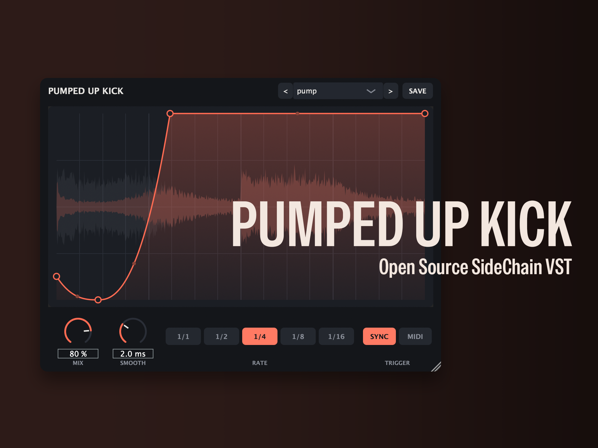

# PumpedUpKick



一款免费、轻量的侧链压缩插件 —— 融合 KickStarter 的即插即用工作流与 LFOTool 式的包络控制。

**AU / VST3 / Standalone** · macOS、Windows 与 Linux · 基于 [JUCE 8](https://juce.com) 构建 (AGPLv3)

## 功能特性

- **单旋钮工作流** —— 选一个预设、设置速率、调整 Mix 旋钮，搞定。
- **BPM 同步压缩** —— 锁定宿主时间轴 (1/1， 1/2， 1/4， 1/8， 1/16)。宿主走带暂停时压缩暂停(播放头也会隐藏);只有在完全没有走带信息的场景(如 Standalone 独立运行)才会自由运行。
- **波形显示** —— 在包络曲线背后画出最近一个周期的压缩前(灰色)与压缩后(橙色)波形，清楚看到具体被"吃掉"了多少。
- **完整的包络编辑**(LFOTool 风格):
  - 拖动控制点移动(按住 **Shift** 吸附网格)
  - **双击**空白处新增控制点
  - **双击 / 右键 / ⌥ 点击**控制点将其删除
  - 拖动线段的**中点手柄**上下移动来弯曲曲线
- **MIDI one-shot 触发** —— 将 Trigger 切换为 **MIDI**，包络只在收到音符时触发，非常适合非四四拍的节奏型;音符之间音频原样通过不做处理。
- **预设** —— 5 个出厂预设形状(Classic、Soft、Tight、Long Pump、Wobble)，并支持保存自定义预设。
- **平滑控制** —— 无爆音的增益平滑处理 (0.1–20 ms)。
- **极小的资源占用** —— 包络被渲染进一张无锁查找表;音频路径每采样只做一次查表和一次乘法，没有内存分配、没有锁、没有 FFT。

## 安装(下载预编译版本)

从 [Releases](../../releases) 页面下载 zip 包。macOS 版本是通用二进制(同时支持 Apple Silicon 与 Intel)。

**macOS —— 解除隔离属性这一步是必须的。** 本项目是免费软件，没有购买 Apple 开发者账号，因此二进制文件未经 Apple 公证。macOS 会给一切从网上下载的文件打上隔离标记，你的宿主软件会直接拒绝加载。把插件拷贝到位之后，请在终端执行:

```sh
xattr -dr com.apple.quarantine ~/Library/Audio/Plug-Ins/Components/PumpedUpKick.component
xattr -dr com.apple.quarantine ~/Library/Audio/Plug-Ins/VST3/PumpedUpKick.vst3
```
如果你不想执行命令行，也可以选择自行从源码编译：本地编译出来的产物不带隔离属性，装上就能直接使用。

**Windows**:把 `PumpedUpKick.vst3` 拷贝到 `C:\Program Files\Common Files\VST3\`。

**Linux**:把 `PumpedUpKick.vst3` 拷贝到 `~/.vst3/`。可在 REAPER、Bitwig、Ardour、Qtractor 等支持 VST3 的宿主中使用。

## 编译构建

依赖要求:CMake ≥ 3.24，支持 C++17 的编译器(macOS 上的 Xcode 命令行工具，Windows 上的 MSVC)。JUCE 会被自动拉取。

```sh
cmake -S . -B build -DCMAKE_BUILD_TYPE=Release
cmake --build build --config Release -j8
```

macOS 构建产物是通用二进制(arm64 + x86_64)，最低系统要求为 macOS 10.13。这两项设置在 [CMakeLists.txt](CMakeLists.txt) 中必须写在 `project()` **之前**，这一点至关重要:`project()` 自身就会创建这两个缓存条目，写在其后的设置会被静默忽略，结果是产出一个只支持本机架构、且最低系统版本等于构建机系统版本的二进制——而它在构建者自己的机器上一切正常，毫无异样。如果你有本次修复之前遗留的构建目录，请直接删除:陈旧的缓存会一直保留旧值，无论 CMakeLists 怎么改都不会生效。

在 macOS 上，AU 和 VST3 会被自动拷贝到:

- `~/Library/Audio/Plug-Ins/Components/PumpedUpKick.component`(Logic Pro)
- `~/Library/Audio/Plug-Ins/VST3/PumpedUpKick.vst3`(FL Studio、Ableton 等)

如果 Logic 没有立即识别到 AU，运行 `auval -a` 或重启 Logic(启动时会重新扫描)。

在 Windows 上，将 `build/PumpedUpKick_artefacts/Release/VST3/PumpedUpKick.vst3` 拷贝到 `C:\Program Files\Common Files\VST3\`。

## MIDI one-shot 触发模式使用指南

> 注意：本部分内容由 Claude 编写。目前我无法亲自测试每一个 DAW，**以下说明仅供参考！！** 请勿盲目相信！

Sync 模式不需要任何路由——把插件当普通音频效果器插上就自动对拍。**MIDI 触发**(one-shot)模式服务于所有非四四拍的场景:把 **TRIGGER** 切到 **MIDI** 后,每收到一个 Note-On 包络精确跑一遍(任何音高、任何力度都可以,二者均被忽略),**RATE** 决定单次包络的时长(1/4 = 一拍)。音符之间音频原样通过。唯一的门槛在于:你的宿主需要把 MIDI 音符路由*进一个音频效果器*,而每家宿主的做法都不一样。

**Logic Pro** —— Logic 的音频效果器收不到 MIDI,须以 MIDI 控制效果器方式加载:
1. 在要被压缩的轨道上,把 **Output** 设为某个总线(如 Bus 1),并将 Logic 自动创建的 Aux **静音**(或把 Aux 输出设为 *No Output*),避免听到未处理的原声。
2. 新建**软件乐器**轨,乐器插槽选 **AU MIDI-controlled Effects → PumpedUp Audio → PumpedUpKick**。
3. 在插件窗口顶栏右侧的 **Side Chain** 菜单中选择 Bus 1。
4. 在这条乐器轨上弹奏或写 MIDI 音符——每个音符触发一次包络。

**FL Studio**
1. 把 PumpedUpKick 加载到目标轨道的混音器插槽上。
2. 打开插件包装器的齿轮菜单 → *Settings*,把 **MIDI input port** 设为一个编号(如 1)。
3. 在 Channel Rack 中添加一个 **MIDI Out** 通道,把它的 **Port** 设为相同编号。在该通道上弹奏的音符即可触发包络。

**Ableton Live**
1. 把 PumpedUpKick 放在音频轨上。
2. 新建一条 MIDI 轨,把 **MIDI To** 设为那条音频轨,并在下方的选择器里选 **PumpedUpKick**。
3. 给 MIDI 轨预备录音后即可触发——clip 或现场演奏都可以。

**REAPER** —— 最简单:轨道效果器直接接收本轨的 MIDI,把 MIDI item 放在音频轨上即可;或从其他轨用发送路由 MIDI(创建 send,音频通道设 *None*,MIDI 设 *All*)。

**Bitwig Studio** —— 新建音符轨,把它的输出选择器指向音频轨上的 PumpedUpKick 设备。

**Cubase** —— 新建 MIDI 轨,在输出路由下拉菜单中选择 PumpedUpKick 实例(接受 MIDI 的插件会列在其中)。

## 分发说明

- **macOS**:若要分发给其他机器使用，需用 Developer ID Application 证书对两个 bundle 分别签名并公证:
  ```sh
  codesign --force --deep --sign "Developer ID Application: …" PumpedUpKick.component
  xcrun notarytool submit … && xcrun stapler staple …
  ```
  未签名的本地构建在自己机器上可以正常使用(Gatekeeper 只检查从网络下载的二进制文件)。
- **Windows**:使用 MSVC 构建(`cmake -G "Visual Studio 17 2022"`);代码签名可选。
- **许可证**:JUCE 以 AGPLv3 协议使用，因此本项目同样采用 AGPLv3 —— 源代码必须保持公开可用。VST3 支持基于 Steinberg 的 VST3 SDK(与 GPLv3 兼容)。"VST" 是 Steinberg Media Technologies GmbH 的注册商标。

## 自动化构建与发布

[.github/workflows/ci.yml](.github/workflows/ci.yml) 在**每次**向 `main` 推送或提交 PR 时运行，构建全部三个平台。它不只检查"能否编译通过"，而是真的把插件加载起来跑一遍:

- `lipo` 断言 `arm64` 与 `x86_64` 两个切片都存在，确保发布版本绝不会悄无声息地丢掉对 Intel Mac 的支持
- `auval`(macOS)会实例化 AU、渲染音频并测试 MIDI 处理
- [pluginval](https://github.com/Tracktion/pluginval) 以最严格的 10 级强度，对 macOS 上的 AU 与 VST3、Windows 上的 VST3、Linux 上的 VST3(通过 `xvfb`)执行参数模糊测试、总线布局与线程安全检查

[.github/workflows/release.yml](.github/workflows/release.yml) 会跑同样的校验流程，然后在你推送版本标签时打包并准备发布:

```sh
git tag v1.0.0
git push origin v1.0.0
```

注意普通的 `git push` 永远不会推送标签，所以日常提交不可能误触发发布。Release 会被创建为**草稿**，自动生成的说明(自上个标签以来的提交记录)和 zip 附件都已就绪——你把说明改写成面向用户的文案，再点击发布即可。

如果只想验证构建是否成功而不打标签，可以在 Actions 页面手动触发工作流(`workflow_dispatch`)，它只产出可下载的构建产物，完全不碰 Release。

目前产物是未签名的(参见上方"分发说明");如需签名/公证，需要在仓库中配置证书密钥，目前尚未接入。

## 许可证

Copyright (C) 2026 CanisAlpha

PumpedUpKick 是自由软件:你可以在自由软件基金会发布的 [GNU Affero 通用公共许可证](LICENSE)(第 3 版或你选择的更新版本)条款下重新分发和/或修改它。完整条款见 [LICENSE](LICENSE) 文件。

界面内嵌 [Special Gothic](https://github.com/AlistairMcCready/Special-Gothic/) 字体,版权归 The Special Gothic Project Authors(2023)所有,以 [SIL Open Font License 1.1](src/font/OFL.txt) 授权使用。

## 用户预设

以 XML 格式保存在:

- macOS:`~/Library/Application Support/PumpedUpKick/Presets/*.pukpreset`
- Windows:`%APPDATA%\PumpedUpKick\Presets\*.pukpreset`

预设文件可移植 —— 直接复制文件即可分享。

## 架构说明

| 模块 | 文件 | 说明 |
|---|---|---|
| 曲线模型 | `src/Curve.h` | 控制点 + 每段张力(tension)、幂函数曲线插值、无锁双缓冲查找表 |
| DSP / 相位引擎 | `src/PluginProcessor.cpp` | Sync 模式下锁定宿主 ppq 的相位计算、MIDI 模式下采样级精度的音符触发、一阶增益平滑 |
| 包络编辑器 | `src/EnvelopeEditor.h` | 矢量绘制，60 fps 播放头动画，带变化检测以跳过多余的重绘 |
| 预设 | `src/Presets.h` | 出厂预设形状 |
| UI | `src/PluginEditor.cpp`， `src/LookAndFeel.h` | 扁平深色主题，可缩放(固定宽高比) |
